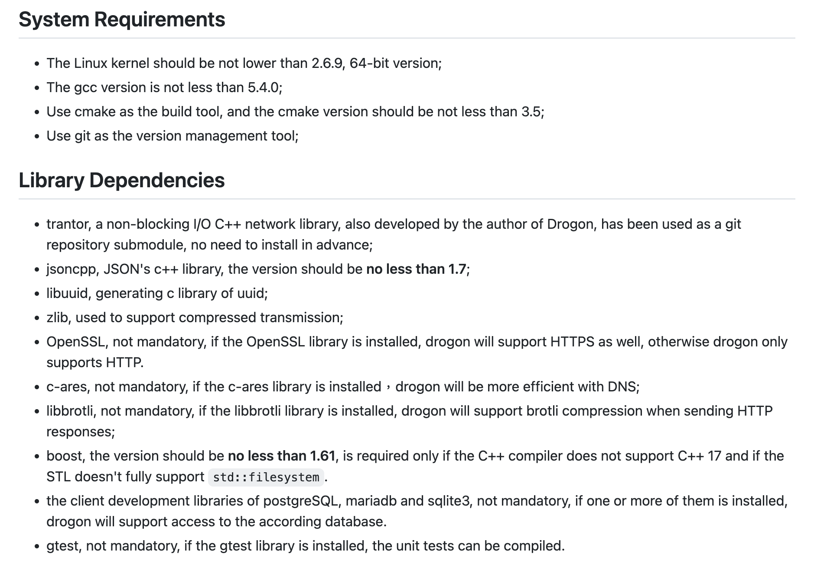
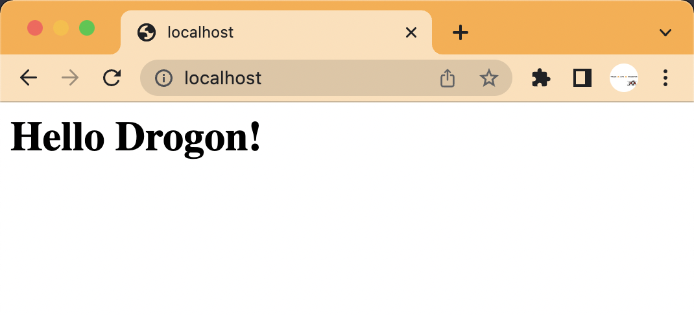

## 先由搭建環境開始

上述的 Teck Stack 若是要寫出第 1 個 Walking skeleton，那至少得先把 Web API 的部分搞定。著手來安裝 Drogon 唄！在 [Drogon 專案的 Wiki Page](https://github.com/drogonframework/drogon/wiki/ENG-02-Installation#System-Requirements) 上有安裝教學，簡單地說要先完成基本工具安裝，還有相依函式庫安裝。

可以依著同一頁的範例，針對你使用的作業系統去安裝好即可：

> 大部分的情況都是用 package manager 可以搞定的。當然，極端的狀態就是由原始碼自己編譯囉！



在處理完基本工具與相依的函式庫之後，就是安裝 Drogon 本身。他有提供直接用原始碼自編的方法，或是用 CMake 等工具直接引用的方式。本來我想先試著用 [CPM](https://github.com/drogonframework/drogon/wiki/ENG-02-Installation#use-cpmcmake) 的方法引用 Drogon 函式庫，畢竟還沒有試過 C++ 的 Dependency Management 工具覺得很新鮮。可是，如果不自己由原始碼編譯，就沒有 Drogon 的控制指令可以用了！那我們就來編譯它吧！

### 編譯 Drogon

比對一下目前最新的 release 版本，是 `v1.8.3` 版。那我們將 source code 切到這個 release 的狀態：

```bash
$ git checkout v1.8.3 -b _build_from_v1.8.3
Switched to a new branch '_build_from_v1.8.3'
```

雖然，他的範例只有 Linux 與 Windows。對使用 MacOS 的我，[直接參考 Linux 版](https://github.com/drogonframework/drogon/wiki/ENG-02-Installation#Install-by-source-in-Linux)即可。反正，缺 Library 就補 Library，補不了就把它 Disable 掉看看囉！它給了下面的參考指令：

```bash
cd $WORK_PATH
git clone https://github.com/drogonframework/drogon
cd drogon
git submodule update --init
mkdir build
cd build
cmake ..
make && sudo make install
```

但是對於安裝的路徑會想修改一下，不想直接裝在系統路徑內。文件有提到可以用 `CMAKE_INSTALL_PREFIX` 來變更安裝路徑。但對於 CMake 有點陌生，查了一下用法可以設在 `CMakeLists.txt` 之中，我把它安裝在專案內的 `install` 目錄：

```diff
diff --git a/CMakeLists.txt b/CMakeLists.txt
index eb8a266..bcd6dc7 100755
--- a/CMakeLists.txt
+++ b/CMakeLists.txt
@@ -1,6 +1,7 @@
 cmake_minimum_required(VERSION 3.5)
 
 project(drogon)
+set(CMAKE_INSTALL_PREFIX ${PROJECT_SOURCE_DIR}/install)
 
 message(STATUS "compiler: " ${CMAKE_CXX_COMPILER_ID})
```

在 `install` 目錄內有這樣的結構，可以將 `bin` 加入 PATH 變數以方便使用：

```bash
$ tree -L 2
.
├── bin
│   ├── dg_ctl -> ./drogon_ctl
│   └── drogon_ctl
├── include
│   ├── drogon
│   └── trantor
└── lib
    ├── cmake
    ├── libdrogon.a
    └── libtrantor.a
```

先有了個基本的版本，其他的 Library 有用到時再來編譯唄：

```bash
$ dg_ctl version
     _
  __| |_ __ ___   __ _  ___  _ __
 / _` | '__/ _ \ / _` |/ _ \| '_ \
| (_| | | | (_) | (_| | (_) | | | |
 \__,_|_|  \___/ \__, |\___/|_| |_|
                 |___/

A utility for drogon
Version: 1.8.3
Git commit: 0b3147c15764820c2624a557b83b2b3343d9810a
Compilation:
  Compiler: /Applications/Xcode.app/Contents/Developer/Toolchains/XcodeDefault.xctoolchain/usr/bin/c++
  Compiler ID: AppleClang
  Compilation flags: -std=c++17 -I/opt/homebrew/include -I/Users/qrtt1/temp/drogon/install/include
Libraries:
  postgresql: yes  (pipeline mode: yes)
  mariadb: no
  sqlite3: yes
  openssl: no
  brotli: no
  boost: no
  hiredis: no
  c-ares: no
```

### Drogon Quick Start

編完 Drogon 後，就可以來試看看 [Quick Start](https://github.com/drogonframework/drogon/wiki/ENG-03-Quick-Start) 內的東西囉！

```bash
$ drogon_ctl create project gaas_cpp
```

```bash
$ tree
.
├── CMakeLists.txt
├── build
├── config.json
├── controllers
├── filters
├── main.cc
├── models
│   └── model.json
├── plugins
├── test
│   ├── CMakeLists.txt
│   └── test_main.cc
└── views
```

進入 `build` 內編出執行檔：

```bash
cd build
cmake ..
make
```

加入了 `index.html` 印出 **Hello Drogon** 字樣：



到這一個階段，完成了使用 Drogon 開啟一個 `static site` 的工作，接著文件的下一步是要開 `dynamic site` 也就是加入 Controller 可以動態處理 HTTP Request / HTTP Response 的部分囉。

```bash
$ drogon_ctl create controller NothingCtrl
```

它產生 2 個檔案，分別是 header 檔與 `.cc` 實作檔：

```diff
diff --git a/NothingCtrl.cc b/NothingCtrl.cc
new file mode 100644
index 0000000..9ca8d58
--- /dev/null
+++ b/NothingCtrl.cc
@@ -0,0 +1,6 @@
+#include "NothingCtrl.h"
+
+void NothingCtrl::asyncHandleHttpRequest(const HttpRequestPtr& req, std::function<void (const HttpResponsePtr &)> &&callback)
+{
+    // write your application logic here
+}
diff --git a/NothingCtrl.h b/NothingCtrl.h
new file mode 100644
index 0000000..d77afd2
--- /dev/null
+++ b/NothingCtrl.h
@@ -0,0 +1,15 @@
+#pragma once
+
+#include <drogon/HttpSimpleController.h>
+
+using namespace drogon;
+
+class NothingCtrl : public drogon::HttpSimpleController<NothingCtrl>
+{
+  public:
+    void asyncHandleHttpRequest(const HttpRequestPtr& req, std::function<void (const HttpResponsePtr &)> &&callback) override;
+    PATH_LIST_BEGIN
+    // list path definitions here;
+    // PATH_ADD("/path", "filter1", "filter2", HttpMethod1, HttpMethod2...);
+    PATH_LIST_END
+};
```

接續著生出來的骨架，依官方教學加入了下面的實作：

```diff
diff --git a/NothingCtrl.cc b/NothingCtrl.cc
index 9ca8d58..bf8c458 100644
--- a/NothingCtrl.cc
+++ b/NothingCtrl.cc
@@ -2,5 +2,11 @@
 
 void NothingCtrl::asyncHandleHttpRequest(const HttpRequestPtr& req, std::function<void (const HttpResponsePtr &)> &&callback)
 {
-    // write your application logic here
+    //write your application logic here
+    auto resp=HttpResponse::newHttpResponse();
+    //NOTE: The enum constant below is named "k200OK" (as in 200 OK), not "k2000K".
+    resp->setStatusCode(k200OK);
+    resp->setContentTypeCode(CT_TEXT_HTML);
+    resp->setBody("Hello World!");
+    callback(resp);
 }
diff --git a/NothingCtrl.h b/NothingCtrl.h
index d77afd2..db6ca7c 100644
--- a/NothingCtrl.h
+++ b/NothingCtrl.h
@@ -11,5 +11,7 @@ class NothingCtrl : public drogon::HttpSimpleController<NothingCtrl>
     PATH_LIST_BEGIN
     // list path definitions here;
     // PATH_ADD("/path", "filter1", "filter2", HttpMethod1, HttpMethod2...);
+    PATH_ADD("/",Get,Post);
+    PATH_ADD("/test",Get);
     PATH_LIST_END
 };
```

但你重新編譯後，會什麼都沒有變的情況。因為新加入的檔案，並不在 `CMakeLists.txt` 的清單內，再補上就行了：

```diff
diff --git a/CMakeLists.txt b/CMakeLists.txt
index ed84371..cf823fc 100644
--- a/CMakeLists.txt
+++ b/CMakeLists.txt
@@ -19,7 +19,7 @@ endif ()
 set(CMAKE_CXX_STANDARD_REQUIRED ON)
 set(CMAKE_CXX_EXTENSIONS OFF)

-add_executable(${PROJECT_NAME} main.cc)
+add_executable(${PROJECT_NAME} main.cc NothingCtrl.cc)

 # ##############################################################################
 # If you include the drogon source code locally in your project, use this method
```

