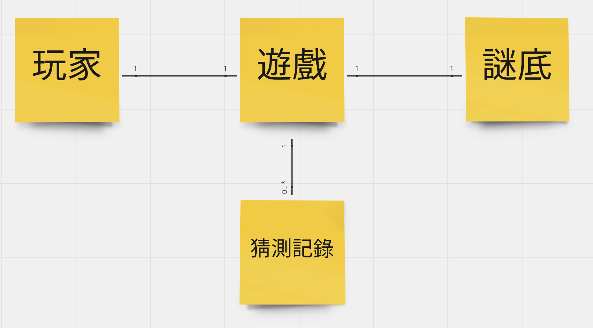

## 讓我們選個簡單的遊戲實戰吧！

在本文最開頭講的，焦點會是 Tech Stack 難度的體驗。在已經完成了第 1 組無用的 Walking Skeleton 後，我們可以開始寫一點遊戲的部分。讓它去跟 Teck Stack 產生摩擦，再來感受到阻礙我們前進的力道有多強。

以「1A2B 型式的猜數字」遊戲為例，玩家有 2 個 Command 可以行動

- 開始一場遊戲
- 猜測一個數字

基本規則：

- 遊戲開始時，系統會產生一組隨機的 4 位數數值。個別的數字之間，不能有重複的情況，並且 0 不會在千分位的位置。
- 當玩家輸入數字時，也必需符合系統產生的規則。系統會對輸入的數字做出 `幾A 幾B` 的回應。

舉例來說：

- 系統謎底為 `1234` 若玩家猜測為 `1234`，系統應回應提示 `4A` 並結束遊戲，宣告玩家猜中數字。
- 系統謎底為 `1234` 若玩家猜測為 `2134`，系統應回應提示 `2A2B` 並繼續遊戲。因為最後的 `34` 位置與謎底吻合，屬於數字與位置都猜對，判定為 `2A`。前面的 `21` 則只有數字對了，但位置不對，得 `2B`。
- 系統謎底為 `1234` 若玩家猜測為 `4567`，系統應回應提示 `0A1B` 並繼續遊戲。因為，只有 `4` 猜中，但位置不對，其於皆沒在謎底出現。

由上述的規則，大概可以看出它們的關係：

