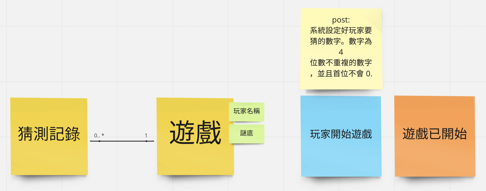

## Repository 與 Aggregate Root

在有較多基礎建設後，可以開始來實作真正的邏輯了，也就是「查改存推」的部分。在比較單純的情況，我們幾乎可以把 UseCase 與 Event Storming 上的 Command 對應，特別當 Actor 是玩家本人的時候。

在這個迷你的遊戲題目中，活跳跳的 Actor 也只有玩家。當玩家建立遊戲後，我們得在 UseCase 中替它建立相對應的 Domain Model。回顧一下類別關係，那個維護世界和平 (**保持 invariants 不被爆破**) 的大統領 Aggregate Root，很直覺會是 `遊戲 (Game)` 本身，因為它相依所有其他的類別。在明確知道 Aggregate Root 為 `遊戲 (Game)` 後，我們的 Repository 管理的對象就明白了。

先來想像一下，它會實作為：

```cpp
void CreateGameUseCase::execute(Input input, Output &output) {
    // 用 repo 查改存推
    auto game = gameRepository.create(input.playerName);
    
    output.gameId = game.id;
    output.playerName = game.playerName;
}
```

可以參考一下原本寫的。因為還沒有 Repository 可以用，我們單純 hardcode 部分結果，與 Client 端傳進來的參數，讓 Output 可以生資料來通過測試：

```diff
diff --git a/CreateGameUseCase.cc b/CreateGameUseCase.cc
index bfcfb95..bb09e98 100644
--- a/CreateGameUseCase.cc
+++ b/CreateGameUseCase.cc
@@ -1,5 +1,6 @@
 #include "CreateGameUseCase.h"
 #include <nlohmann/json.hpp>
+#include "GameRepository.h"
 
 using namespace std;
 using json = nlohmann::json;
@@ -9,8 +10,11 @@ Input::Input(string playerName) {
 }
 
 void CreateGameUseCase::execute(Input input, Output &output) {
-    output.gameId = "5566";
-    output.playerName = input.playerName;
+    // 用 repo 查改存推
+    auto game = gameRepository.create(input.playerName);
+    
+    output.gameId = game.id;
+    output.playerName = game.playerName;
 }
 
 string Output::to_json() {
```

理論上，我們透過這樣以終為始的逆向行車，來把相依的類別或功能開出來。這個過程，你依然可以順應著 ATDD 的節奏，反射性地跑個測試囉：

```bash
====================[ Build | gaas_cpp_test | Debug ]===========================
"/Users/qrtt1/Library/Application Support/JetBrains/Toolbox/apps/CLion/ch-0/223.8617.54/CLion.app/Contents/bin/cmake/mac/bin/cmake" --build /Users/qrtt1/temp/gaas_cpp/cmake-build-debug --target gaas_cpp_test -j 8
[0/1] Re-running CMake...
-- CPM: Adding package json@3.10.5 (v3.10.5)
-- Using the single-header code from /Users/qrtt1/temp/gaas_cpp/cmake-build-debug/_deps/json-src/single_include/
-- jsoncpp verson:1.9.5
-- Found UUID: 
-- pg inc: /opt/homebrew/include/postgresql@14/opt/homebrew/include/postgresql@14/server
-- use c++17
-- Configuring done
-- Generating done
-- Build files have been written to: /Users/qrtt1/temp/gaas_cpp/cmake-build-debug
[2/4] Building CXX object test/CMakeFiles/gaas_cpp_test.dir/__/CreateGameUseCase.cc.o
FAILED: test/CMakeFiles/gaas_cpp_test.dir/__/CreateGameUseCase.cc.o 
/Applications/Xcode.app/Contents/Developer/Toolchains/XcodeDefault.xctoolchain/usr/bin/c++ -DJSON_DIAGNOSTICS=0 -DJSON_USE_IMPLICIT_CONVERSIONS=1 -I/Users/qrtt1/temp/gaas_cpp/cmake-build-debug/_deps/json-src/single_include -isystem /Users/qrtt1/temp/drogon/install/include -isystem /opt/homebrew/include -g -arch arm64 -isysroot /Applications/Xcode.app/Contents/Developer/Platforms/MacOSX.platform/Developer/SDKs/MacOSX12.3.sdk -mmacosx-version-min=12.1 -fcolor-diagnostics -std=c++17 -MD -MT test/CMakeFiles/gaas_cpp_test.dir/__/CreateGameUseCase.cc.o -MF test/CMakeFiles/gaas_cpp_test.dir/__/CreateGameUseCase.cc.o.d -o test/CMakeFiles/gaas_cpp_test.dir/__/CreateGameUseCase.cc.o -c /Users/qrtt1/temp/gaas_cpp/CreateGameUseCase.cc
/Users/qrtt1/temp/gaas_cpp/CreateGameUseCase.cc:14:32: error: no member named 'create' in 'GameRepository'
    auto game = gameRepository.create(input.playerName);
                ~~~~~~~~~~~~~~ ^
1 error generated.
[3/4] Building CXX object test/CMakeFiles/gaas_cpp_test.dir/__/CreateGameCtrl.cc.o
ninja: build stopped: subcommand failed.
```


## 實作 Repository 與 Game Model

在這邊的實作，就比較像開發日常的例行公事，例如：把類別開出來，該加的方法加一加而己。有一個部分需要簡單說明的。那就是 `GameRepository` 還未正式使用任何的資料庫，我們純粹使用一個 `map` 來當作有 Storage 罷了。

由於 `GameRepository` 正式上線了，我們的測試就可以寫的更加「真實」，因為它作為管理「狀態」的主要容器，我們可以在得知 HTTP Client 的資料後，一個 move 轉身像 Repository 查證是否為真。這一次的修改，我們就可以查著 `gameId` 再去問一次 Repository 是否認得它？

```diff
diff --git a/CMakeLists.txt b/CMakeLists.txt
index bcb1cc0..7f01bb7 100644
--- a/CMakeLists.txt
+++ b/CMakeLists.txt
@@ -19,7 +19,7 @@ endif ()
 set(CMAKE_CXX_STANDARD_REQUIRED ON)
 set(CMAKE_CXX_EXTENSIONS OFF)
 
-add_executable(${PROJECT_NAME} main.cc NothingCtrl.cc CreateGameCtrl.cc CreateGameUseCase.cc GameRepository.cc)
+add_executable(${PROJECT_NAME} main.cc NothingCtrl.cc CreateGameCtrl.cc CreateGameUseCase.cc GameRepository.cc Models.cpp)
 
 
 # add dependencies
diff --git a/GameRepository.cc b/GameRepository.cc
index 7ec726e..bf89bcf 100644
--- a/GameRepository.cc
+++ b/GameRepository.cc
@@ -1 +1,30 @@
+#include <random>
+#include <iostream>
 #include "GameRepository.h"
+
+GameRepository gameRepository;
+
+GameRepository::~GameRepository() {
+    std::cout << "Invoke ~GameRepository" << std::endl;
+    for (auto it = storage.begin(); it != storage.end(); ++it) {
+        delete it->second;
+    }
+}
+
+
+const std::string randomId() {
+    srand(time(0));
+    return std::to_string(rand());
+}
+
+const Game &GameRepository::create(std::string playerName) {
+    Game *game = new Game();
+    game->id = randomId();
+    game->playerName = playerName;
+    storage[game->id] = game;
+    return *game;
+}
+
+const Game &GameRepository::findGameById(std::string gameId) {
+    return *storage[gameId];
+}
diff --git a/GameRepository.h b/GameRepository.h
index 4167254..a686ceb 100644
--- a/GameRepository.h
+++ b/GameRepository.h
@@ -1,7 +1,20 @@
 #pragma once
 
+#include <string>
+#include <map>
+#include "Models.h"
+
 class GameRepository {
 
+private:
+    std::map<std::string, Game *> storage;
+
+public:
+    ~GameRepository();
+
+    const Game &create(std::string playerName);
+
+    const Game & findGameById(std::string gameId);
 };
 
-GameRepository gameRepository;
+extern GameRepository gameRepository;
diff --git a/Models.cpp b/Models.cpp
new file mode 100644
index 0000000..0e564cd
--- /dev/null
+++ b/Models.cpp
@@ -0,0 +1,2 @@
+
+#include "Models.h"
diff --git a/Models.h b/Models.h
new file mode 100644
index 0000000..b1b036f
--- /dev/null
+++ b/Models.h
@@ -0,0 +1,10 @@
+#pragma once
+
+#include <string>
+
+class Game {
+
+public:
+    std::string id;
+    std::string playerName;
+};
diff --git a/test/CMakeLists.txt b/test/CMakeLists.txt
index d89969f..4c864a9 100644
--- a/test/CMakeLists.txt
+++ b/test/CMakeLists.txt
@@ -1,7 +1,7 @@
 cmake_minimum_required(VERSION 3.5)
 project(gaas_cpp_test CXX)
 
-add_executable(${PROJECT_NAME} test_main.cc ../NothingCtrl.cc ../CreateGameCtrl.cc ../CreateGameUseCase.cc ../GameRepository.cc)
+add_executable(${PROJECT_NAME} test_main.cc ../NothingCtrl.cc ../CreateGameCtrl.cc ../CreateGameUseCase.cc ../GameRepository.cc ../Models.cpp)
 
 # add dependencies
 include(../cmake/CPM.cmake)
diff --git a/test/test_main.cc b/test/test_main.cc
index 9b9e8e3..85c2a62 100644
--- a/test/test_main.cc
+++ b/test/test_main.cc
@@ -3,6 +3,7 @@
 #include <drogon/drogon_test.h>
 #include <drogon/drogon.h>
 #include <nlohmann/json.hpp>
+#include "../GameRepository.h"
 
 using namespace drogon;
 using json = nlohmann::json;
@@ -42,8 +43,10 @@ DROGON_TEST(CreateGameAPITest) {
         CHECK(resp->contentType() == CT_APPLICATION_JSON);
 
         auto result = json::parse(resp->getBody());
-        CHECK("5566" == result["game_id"]);
+        auto game = gameRepository.findGameById(result["game_id"]);
+
         CHECK("I have no name" == result["player_name"]);
+        CHECK("I have no name" == game.playerName);
     });
 
 }
```

接下來，我們的建立遊戲其實還沒完工。因為它並沒有滿足 `post-condition`，並且在實作過程中，決定應該簡化一下類別數量。畢竟，這簡單的單人遊戲管理 `玩家` 似乎還沒有必要，就讓它成為 `遊戲` 的欄位即可，同樣的 `謎底 (Answer)` 也適合直接作為欄位放在遊戲之中，剩下的工作項目就剩：

- 建立 answer 欄位
- 建立猜測記錄 (Record)



```diff
diff --git a/CreateGameUseCase.cc b/CreateGameUseCase.cc
index bb09e98..b998942 100644
--- a/CreateGameUseCase.cc
+++ b/CreateGameUseCase.cc
@@ -12,14 +12,21 @@ Input::Input(string playerName) {
 void CreateGameUseCase::execute(Input input, Output &output) {
     // 用 repo 查改存推
     auto game = gameRepository.create(input.playerName);
-    
-    output.gameId = game.id;
-    output.playerName = game.playerName;
+    output.game = game;
 }
 
+
 string Output::to_json() {
-    // TODO add real history
-    return json{{"game_id",     this->gameId},
-                {"player_name", this->playerName},
+    json history = json::array();
+    for (const auto &record: this->game.history) {
+        json entry;
+        entry["guess"] = record->guess;
+        entry["respond"] = record->respond;
+        history.push_back(entry);
+    }
+
+    return json{{"game_id",     this->game.id},
+                {"player_name", this->game.playerName},
+                {"history",     history}
     }.dump();
 }
diff --git a/CreateGameUseCase.h b/CreateGameUseCase.h
index 9ae95b4..23948ab 100644
--- a/CreateGameUseCase.h
+++ b/CreateGameUseCase.h
@@ -2,6 +2,7 @@
 
 #include <string>
 #include <list>
+#include "Models.h"
 
 using namespace std;
 
@@ -17,11 +18,7 @@ class Output {
 
 
 public:
-    string gameId;
-    string playerName;
-
-//    TODO define the history entry
-//    list<Record> history;
+    Game game;
 
     string to_json();
 };
diff --git a/Models.cpp b/Models.cpp
index 0e564cd..06379b7 100644
--- a/Models.cpp
+++ b/Models.cpp
@@ -1,2 +1,12 @@
 
 #include "Models.h"
+
+Game::~Game() {
+    for (auto it = history.begin(); it != history.end(); ++it) {
+        delete *it;
+    }
+}
+
+Game::Game() {
+    this->answer = 1234;
+}
diff --git a/Models.h b/Models.h
index b1b036f..7bc1580 100644
--- a/Models.h
+++ b/Models.h
@@ -1,10 +1,23 @@
 #pragma once
 
 #include <string>
+#include <list>
+
+class Record {
+public:
+    int guess;
+    std::string respond;
+};
 
 class Game {
 
 public:
     std::string id;
     std::string playerName;
+    int answer;
+    std::list<Record *> history;
+
+    Game();
+
+    ~Game();
 };
diff --git a/test/test_main.cc b/test/test_main.cc
index 85c2a62..a15f55f 100644
--- a/test/test_main.cc
+++ b/test/test_main.cc
@@ -47,6 +47,7 @@ DROGON_TEST(CreateGameAPITest) {
 
         CHECK("I have no name" == result["player_name"]);
         CHECK("I have no name" == game.playerName);
+        CHECK(result["history"].empty());
     });
 
 }
```

在上面的實作中，我們其實只有多加了 `history` 欄位，與實際記錄猜測歷程的 `Record` 類別。同時，我們加了個測試，確定 `history` 真的是空的。但你會發現，雖然建好了 `answer` 卻給它 hardcode 成了 1234。主要是因為，我們還沒有任何的測試案例會走訪到它，先有個「極簡」的版本就好，後續加上了猜數字的 UseCase 後就可以面對它了！
