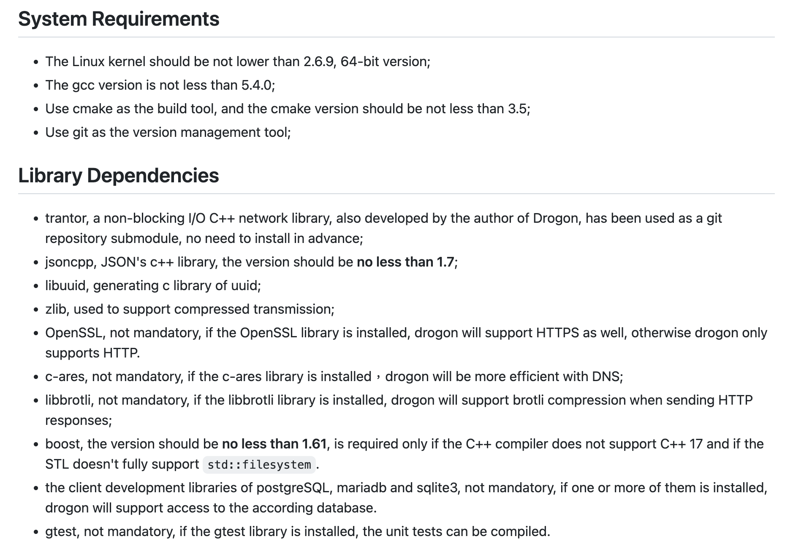

# 感受世界的痛楚吧！也試著用 C++ 寫看看好了。

## 為什麼有這個念頭呢？

看著遊戲微服務計劃的各組在努力著，有的組很快速地完成前期的設計並進入了 ATDD 實戰開發階段，有些組則進度較為遲一些。其中，較吸引眾人眼球的專案之一，莫過於決定使用 C++ 開發的組別了。秉持著唯有實際體驗才能理解對方的難處，在心中萌起了是不是自己也用著相同的 Tech Stack 也寫看看的想法！

在動手實作之前，先想一下目標是什麼？是要寫一樣的遊戲嗎？其實不是，重點應該不是遊戲，因為遊戲主要是一個有豐富 Domain 主題，讓參與計劃的人可以聚焦，用它來做 Practice Stack 部分的學習與箇中流程的體驗。所以，採用 C++ 來寫看看想要體驗的應該是 Tech Stack 搭建的難度以及實戰 ATDD 流程的便利性評估。

Tech Stack 部分，會參考 [骰子街 C++ 組](https://github.com/Game-as-a-Service/Machi-Koro-Cpp) 的 Tech Stack：

- C++
- [Framework: Drogon](https://github.com/drogonframework/drogon)
- DB: MongoDB
- 前端：Vue

## 先由搭建環境開始

上述的 Teck Stack 若是要寫出第 1 個 Walking skeleton，那至少得先把 Web API 的部分搞定。著手來安裝 Drogon 唄！在 [Drogon 專案的 Wiki Page](https://github.com/drogonframework/drogon/wiki/ENG-02-Installation#System-Requirements) 上有安裝教學，簡單地說要先完成基本工具安裝，還有相依函式庫安裝。

可以依著同一頁的範例，針對你使用的作業系統去安裝好即可：

> 大部分的情況都是用 package manager 可以搞定的。當然，極端的狀態就是由原始碼自己編譯囉！



在處理完基本工具與相依的函式庫之後，就是安裝 Drogon 本身。他有提供直接用原始碼自編的方法，或是用 CMake 等工具直接引用的方式。本來我想先試著用 [CPM](https://github.com/drogonframework/drogon/wiki/ENG-02-Installation#use-cpmcmake) 的方法引用 Drogon 函式庫，畢竟還沒有試過 C++ 的 Dependency Management 工具覺得很新鮮。可是，如果不自己由原始碼編譯，就沒有 Drogon 的控制指令可以用了！那我們就來編譯它吧！

### 編譯 Drogon

比對一下目前最新的 release 版本，是 `v1.8.3` 版。那我們將 source code 切到這個 release 的狀態：

```bash
$ git checkout v1.8.3 -b _build_from_v1.8.3
Switched to a new branch '_build_from_v1.8.3'
```

雖然，他的範例只有 Linux 與 Windows。對使用 MacOS 的我，[直接參考 Linux 版](https://github.com/drogonframework/drogon/wiki/ENG-02-Installation#Install-by-source-in-Linux)即可。反正，缺 Library 就補 Library，補不了就把它 Disable 掉看看囉！它給了下面的參考指令：

```bash
cd $WORK_PATH
git clone https://github.com/drogonframework/drogon
cd drogon
git submodule update --init
mkdir build
cd build
cmake ..
make && sudo make install
```

但是對於安裝的路徑會想修改一下，不想直接裝在系統路徑內。文件有提到可以用 `CMAKE_INSTALL_PREFIX` 來變更安裝路徑。但對於 CMake 有點陌生，查了一下用法可以設在 `CMakeLists.txt` 之中，我把它安裝在專案內的 `install` 目錄：

```diff
diff --git a/CMakeLists.txt b/CMakeLists.txt
index eb8a266..bcd6dc7 100755
--- a/CMakeLists.txt
+++ b/CMakeLists.txt
@@ -1,6 +1,7 @@
 cmake_minimum_required(VERSION 3.5)
 
 project(drogon)
+set(CMAKE_INSTALL_PREFIX ${PROJECT_SOURCE_DIR}/install)
 
 message(STATUS "compiler: " ${CMAKE_CXX_COMPILER_ID})
```

在 `install` 目錄內有這樣的結構，可以將 `bin` 加入 PATH 變數以方便使用：

```bash
$ tree -L 2
.
├── bin
│   ├── dg_ctl -> ./drogon_ctl
│   └── drogon_ctl
├── include
│   ├── drogon
│   └── trantor
└── lib
    ├── cmake
    ├── libdrogon.a
    └── libtrantor.a
```

先有了個基本的版本，其他的 Library 有用到時再來編譯唄：

```bash
$ dg_ctl version
     _
  __| |_ __ ___   __ _  ___  _ __
 / _` | '__/ _ \ / _` |/ _ \| '_ \
| (_| | | | (_) | (_| | (_) | | | |
 \__,_|_|  \___/ \__, |\___/|_| |_|
                 |___/

A utility for drogon
Version: 1.8.3
Git commit: 0b3147c15764820c2624a557b83b2b3343d9810a
Compilation:
  Compiler: /Applications/Xcode.app/Contents/Developer/Toolchains/XcodeDefault.xctoolchain/usr/bin/c++
  Compiler ID: AppleClang
  Compilation flags: -std=c++17 -I/opt/homebrew/include -I/Users/qrtt1/temp/drogon/install/include
Libraries:
  postgresql: yes  (pipeline mode: yes)
  mariadb: no
  sqlite3: yes
  openssl: no
  brotli: no
  boost: no
  hiredis: no
  c-ares: no
```

### Drogon Quick Start

編完 Drogon 後，就可以來試看看 [Quick Start](https://github.com/drogonframework/drogon/wiki/ENG-03-Quick-Start) 內的東西囉！

```bash
$ drogon_ctl create project gaas_cpp
```

```bash
$ tree
.
├── CMakeLists.txt
├── build
├── config.json
├── controllers
├── filters
├── main.cc
├── models
│   └── model.json
├── plugins
├── test
│   ├── CMakeLists.txt
│   └── test_main.cc
└── views
```

進入 `build` 內編出執行檔：

```bash
cd build
cmake ..
make
```

加入了 `index.html` 印出 **Hello Drogon** 字樣：


到這一個階段，完成了使用 Drogon 開啟一個 `static site` 的工作，接著文件的下一步是要開 `dynamic site` 也就是加入 Controller 可以動態處理 HTTP Request / HTTP Response 的部分囉。

```bash
$ drogon_ctl create controller NothingCtrl
```

它產生 2 個檔案，分別是 header 檔與 `.cc` 實作檔：

```diff
diff --git a/NothingCtrl.cc b/NothingCtrl.cc
new file mode 100644
index 0000000..9ca8d58
--- /dev/null
+++ b/NothingCtrl.cc
@@ -0,0 +1,6 @@
+#include "NothingCtrl.h"
+
+void NothingCtrl::asyncHandleHttpRequest(const HttpRequestPtr& req, std::function<void (const HttpResponsePtr &)> &&callback)
+{
+    // write your application logic here
+}
diff --git a/NothingCtrl.h b/NothingCtrl.h
new file mode 100644
index 0000000..d77afd2
--- /dev/null
+++ b/NothingCtrl.h
@@ -0,0 +1,15 @@
+#pragma once
+
+#include <drogon/HttpSimpleController.h>
+
+using namespace drogon;
+
+class NothingCtrl : public drogon::HttpSimpleController<NothingCtrl>
+{
+  public:
+    void asyncHandleHttpRequest(const HttpRequestPtr& req, std::function<void (const HttpResponsePtr &)> &&callback) override;
+    PATH_LIST_BEGIN
+    // list path definitions here;
+    // PATH_ADD("/path", "filter1", "filter2", HttpMethod1, HttpMethod2...);
+    PATH_LIST_END
+};
```

接續著生出來的骨架，依官方教學加入了下面的實作：

```diff
diff --git a/NothingCtrl.cc b/NothingCtrl.cc
index 9ca8d58..bf8c458 100644
--- a/NothingCtrl.cc
+++ b/NothingCtrl.cc
@@ -2,5 +2,11 @@
 
 void NothingCtrl::asyncHandleHttpRequest(const HttpRequestPtr& req, std::function<void (const HttpResponsePtr &)> &&callback)
 {
-    // write your application logic here
+    //write your application logic here
+    auto resp=HttpResponse::newHttpResponse();
+    //NOTE: The enum constant below is named "k200OK" (as in 200 OK), not "k2000K".
+    resp->setStatusCode(k200OK);
+    resp->setContentTypeCode(CT_TEXT_HTML);
+    resp->setBody("Hello World!");
+    callback(resp);
 }
diff --git a/NothingCtrl.h b/NothingCtrl.h
index d77afd2..db6ca7c 100644
--- a/NothingCtrl.h
+++ b/NothingCtrl.h
@@ -11,5 +11,7 @@ class NothingCtrl : public drogon::HttpSimpleController<NothingCtrl>
     PATH_LIST_BEGIN
     // list path definitions here;
     // PATH_ADD("/path", "filter1", "filter2", HttpMethod1, HttpMethod2...);
+    PATH_ADD("/",Get,Post);
+    PATH_ADD("/test",Get);
     PATH_LIST_END
 };
```

但你重新編譯後，會什麼都沒有變的情況。因為新加入的檔案，並不在 `CMakeLists.txt` 的清單內，再補上就行了：

```diff
diff --git a/CMakeLists.txt b/CMakeLists.txt
index ed84371..cf823fc 100644
--- a/CMakeLists.txt
+++ b/CMakeLists.txt
@@ -19,7 +19,7 @@ endif ()
 set(CMAKE_CXX_STANDARD_REQUIRED ON)
 set(CMAKE_CXX_EXTENSIONS OFF)

-add_executable(${PROJECT_NAME} main.cc)
+add_executable(${PROJECT_NAME} main.cc NothingCtrl.cc)

 # ##############################################################################
 # If you include the drogon source code locally in your project, use this method
```

## 開始研究 ATDD 基礎建設部分

在 Drogon 專案的 Wiki Page 中有介紹他的 [Testing Framework](https://github.com/drogonframework/drogon/wiki/ENG-18-Testing-Framework)。若是把它複製到透過 `dragon_ctl` 建好的 `test/test_main.cc` 內，是無法直接使用的。因為除了 `namespace` 沒有適當的引用，還有缺少了 method call 的 `()` 外，在 Web Application 啟動的部分，缺少了 Listener 無法接收外來的 HTTP Request。

為了達成第一個 end-to-end test，我做了下面的修改，摘要如下：

- NothingCtrl 改回傳 JSON 格式
- 在 test 的 CMakeLists.txt 將 NothingCtrl 加入 compile 清單
- [由 Wiki 中複製 `RemoteAPITest` 範例](https://github.com/drogonframework/drogon/wiki/ENG-18-Testing-Framework#asynchronous-testing)，並修正無法編譯的內容
- 追加 `addListener` 與指定要使用的 port
- 修改 Http Client 連線位置，由 `localhost` 改成 `127.0.0.1`（因為實測沒有自動 resolve domain name）。

```diff
diff --git a/NothingCtrl.cc b/NothingCtrl.cc
index bf8c458..6b0a6de 100644
--- a/NothingCtrl.cc
+++ b/NothingCtrl.cc
@@ -7,6 +7,7 @@ void NothingCtrl::asyncHandleHttpRequest(const HttpRequestPtr& req, std::functio
     //NOTE: The enum constant below is named "k200OK" (as in 200 OK), not "k2000K".
     resp->setStatusCode(k200OK);
     resp->setContentTypeCode(CT_TEXT_HTML);
-    resp->setBody("Hello World!");
+    resp->setBody("{\"hello\": \"world\"}");
+    resp->setContentTypeCode(CT_APPLICATION_JSON);
     callback(resp);
 }
diff --git a/test/CMakeLists.txt b/test/CMakeLists.txt
index 8d9b0f9..6f53151 100644
--- a/test/CMakeLists.txt
+++ b/test/CMakeLists.txt
@@ -1,7 +1,7 @@
 cmake_minimum_required(VERSION 3.5)
 project(gaas_cpp_test CXX)
 
-add_executable(${PROJECT_NAME} test_main.cc)
+add_executable(${PROJECT_NAME} test_main.cc ../NothingCtrl.cc)
 
 # ##############################################################################
 # If you include the drogon source code locally in your project, use this method
diff --git a/test/test_main.cc b/test/test_main.cc
index 7370b29..0a26ce3 100644
--- a/test/test_main.cc
+++ b/test/test_main.cc
@@ -2,6 +2,25 @@
 #include <drogon/drogon_test.h>
 #include <drogon/drogon.h>
 
+using namespace drogon;
+
+DROGON_TEST(RemoteAPITest)
+{
+    auto client = HttpClient::newHttpClient("http://127.0.0.1:8848");
+    auto req = HttpRequest::newHttpRequest();
+    req->setPath("/");
+    client->sendRequest(req, [TEST_CTX](ReqResult res, const HttpResponsePtr& resp) {
+        // There's nothing we can do if the request didn't reach the server
+        // or the server generated garbage.
+        REQUIRE(res == ReqResult::Ok);
+        REQUIRE(resp != nullptr);
+
+        CHECK(resp->getStatusCode() == HttpStatusCode::k200OK);
+        CHECK(resp->contentType() == CT_APPLICATION_JSON);
+    });
+
+}
+
 DROGON_TEST(BasicTest)
 {
     // Add your tests here
@@ -18,6 +37,7 @@ int main(int argc, char** argv)
     std::thread thr([&]() {
         // Queues the promise to be fulfilled after starting the loop
         app().getLoop()->queueInLoop([&p1]() { p1.set_value(); });
+        app().addListener("127.0.0.1", 8848);
         app().run();
     });
```

## ATDD 前哨站

到目前為止，我們做出了第 1 隻 Controller 與它的「單蠢」測試案例。若要更進一步，讓這個流程方便，有幾個地方可以改善：

- 怎麼更方便地處理 JSON 呢？在 Controller 內要 encode 成字串，在 Test Case 內要 decode 回 model
- 當新增 Controller 時，怎麼自動去維護二組的 `CMakeLists.txt`？或是這個問題不嚴重，我們不會一直新增 Controller。

第 1 個問題看起來比較值得先搞定，因為它出現的頻率，會比加新的 Controller 要來得多！目前，我們可以放在心上就好，等真的要處理 Model 的輸出再來處理。

第 2 個問題就是 DX (developer experience) 的問題了，儘管在這篇文章中的實驗都是卡在「新增 Controller」，但除了 Controller 本身，我們還有因實作需要的 Domain Model 或是 Use Case，當然還會有各種 Utilities 得照顧到。

目前是「正式開工」前，直接感受到的開發不便之處。但就先記在帳上，在不影響時程的情況下，適時地欠債有助專案發展。

## 讓我們選個簡單的遊戲實戰吧！

在本文最開頭講的，焦點會是 Tech Stack 難度的體驗。在已經完成了第 1 組無用的 Walking Skeleton 後，我們可以開始寫一點遊戲的部分。讓它去跟 Teck Stack 產生摩擦，再來感受到阻礙我們前進的力道有多強。


以「1A2B 型式的猜數字」遊戲為例，玩家有 2 個 Command 可以行動

- 開始一場遊戲
- 猜測一個數字

基本規則：

- 遊戲開始時，系統會產生一組隨機的 4 位數數值。個別的數字之間，不能有重複的情況，並且 0 不會在千分位的位置。
- 當玩家輸入數字時，也必需符合系統產生的規則。系統會對輸入的數字做出 `幾A 幾B` 的回應。

舉例來說：

- 系統謎底為 `1234` 若玩家猜測為 `1234`，系統應回應提示 `4A` 並結束遊戲，宣告玩家猜中數字。
- 系統謎底為 `1234` 若玩家猜測為 `2134`，系統應回應提示 `2A2B` 並繼續遊戲。因為最後的 `34` 位置與謎底吻合，屬於數字與位置都猜對，判定為 `2A`。前面的 `21` 則只有數字對了，但位置不對，得 `2B`。
- 系統謎底為 `1234` 若玩家猜測為 `4567`，系統應回應提示 `0A1B` 並繼續遊戲。因為，只有 `4` 猜中，但位置不對，其於皆沒在謎底出現。

由上述的規則，大概可以看出它們的關係：


## 實作開始遊戲

在動手實作前，我們先想一下要怎麼跟 Game Server 說想開始，例如打一個 `HTTP POST` 給它，再跟他說玩家的名稱呢？

```jsx
POST /guess_number_game:start

{"player_name": "56不能亡"}
```

看起來這已經夠用了，反正它是簡單的單人遊戲，有人要來玩自己就可以開始了，頂多是讓系統知道玩家的暱稱叫什麼而已。那我們期過系統回應的就是 Read Model 相關的內容了，猜測的記錄先不要多想，就放個空的 List 唄：

```jsx
{"game_id": "", "player_name": "", history: []}
```

明白主要目標後，我們先不要多想，單純把 Controller 建出來就行了：

- 一組 Controller
- 一組 Test Case

有了先前的經驗後，行動方案相當明確：

- 先用 `drogon_ctl` 生出 Controller
- 把 Controller 加入編譯清單
- 複製一份 Test Case 確定 Controller 有被測試到
- 修改 Test Case 單純讓它 pass 就行，因為我們還沒有實作真的邏輯 (你要保持紅燈也沒有問題)

```diff
diff --git a/CMakeLists.txt b/CMakeLists.txt
index cf823fc..7597d03 100644
--- a/CMakeLists.txt
+++ b/CMakeLists.txt
@@ -19,7 +19,7 @@ endif ()
 set(CMAKE_CXX_STANDARD_REQUIRED ON)
 set(CMAKE_CXX_EXTENSIONS OFF)
 
-add_executable(${PROJECT_NAME} main.cc NothingCtrl.cc)
+add_executable(${PROJECT_NAME} main.cc NothingCtrl.cc CreateGameCtrl.cc)
 
 # ##############################################################################
 # If you include the drogon source code locally in your project, use this method
diff --git a/CreateGameCtrl.cc b/CreateGameCtrl.cc
new file mode 100644
index 0000000..1ee7579
--- /dev/null
+++ b/CreateGameCtrl.cc
@@ -0,0 +1,13 @@
+#include "CreateGameCtrl.h"
+
+void CreateGameCtrl::asyncHandleHttpRequest(const HttpRequestPtr& req, std::function<void (const HttpResponsePtr &)> &&callback)
+{
+    //write your application logic here
+    auto resp=HttpResponse::newHttpResponse();
+    //NOTE: The enum constant below is named "k200OK" (as in 200 OK), not "k2000K".
+    resp->setStatusCode(k200OK);
+    resp->setContentTypeCode(CT_TEXT_HTML);
+    resp->setBody("{\"hello\": \"world\"}");
+    resp->setContentTypeCode(CT_APPLICATION_JSON);
+    callback(resp);
+}
diff --git a/CreateGameCtrl.h b/CreateGameCtrl.h
new file mode 100644
index 0000000..f09af68
--- /dev/null
+++ b/CreateGameCtrl.h
@@ -0,0 +1,15 @@
+#pragma once
+
+#include <drogon/HttpSimpleController.h>
+
+using namespace drogon;
+
+class CreateGameCtrl : public drogon::HttpSimpleController<CreateGameCtrl>
+{
+  public:
+    void asyncHandleHttpRequest(const HttpRequestPtr& req, std::function<void (const HttpResponsePtr &)> &&callback) override;
+    PATH_LIST_BEGIN
+    // list path definitions here;
+    PATH_ADD("/guess_number_game:start", Post);
+    PATH_LIST_END
+};
diff --git a/test/CMakeLists.txt b/test/CMakeLists.txt
index 6f53151..61a69b4 100644
--- a/test/CMakeLists.txt
+++ b/test/CMakeLists.txt
@@ -1,7 +1,7 @@
 cmake_minimum_required(VERSION 3.5)
 project(gaas_cpp_test CXX)
 
-add_executable(${PROJECT_NAME} test_main.cc ../NothingCtrl.cc)
+add_executable(${PROJECT_NAME} test_main.cc ../NothingCtrl.cc ../CreateGameCtrl.cc)
 
 # ##############################################################################
 # If you include the drogon source code locally in your project, use this method
diff --git a/test/test_main.cc b/test/test_main.cc
index 0a26ce3..ebf5e37 100644
--- a/test/test_main.cc
+++ b/test/test_main.cc
@@ -4,7 +4,7 @@
 
 using namespace drogon;
 
-DROGON_TEST(RemoteAPITest)
+DROGON_TEST(NothingAPITest)
 {
     auto client = HttpClient::newHttpClient("http://127.0.0.1:8848");
     auto req = HttpRequest::newHttpRequest();
@@ -21,11 +21,26 @@ DROGON_TEST(RemoteAPITest)
 
 }
 
-DROGON_TEST(BasicTest)
+DROGON_TEST(CreateGameAPITest)
 {
-    // Add your tests here
+    auto client = HttpClient::newHttpClient("http://127.0.0.1:8848");
+    auto req = HttpRequest::newHttpRequest();
+    req->setPath("/guess_number_game:start");
+    req->setMethod(HttpMethod::Post);
+    client->sendRequest(req, [TEST_CTX](ReqResult res, const HttpResponsePtr& resp) {
+        // There's nothing we can do if the request didn't reach the server
+        // or the server generated garbage.
+        REQUIRE(res == ReqResult::Ok);
+        REQUIRE(resp != nullptr);
+
+        CHECK(resp->getStatusCode() == HttpStatusCode::k200OK);
+        CHECK(resp->contentType() == CT_APPLICATION_JSON);
+    });
+
 }
 
+
+
 int main(int argc, char** argv) 
 {
     using namespace drogon;
```

做完了「殻」之後呢？就可以來寫跟遊戲比較相關的部分了。若是以 Clean Architecture 為偏好的話，我們接著得做：

- Controller → UseCase
- UseCase → Repository
- Repository → Domain Model

製作一個 UseCase 來 `查改存推` 我們的 Domain Model，如果想早一點關心到 `I/O` 那 Repository 也可以提早做。即便，此時此刻還沒有多想要不要弄 Database 或 Storage，但它的「意圖」可以先透過 Repository 表現出來。接著 Repository 是真正管理到 Domain Model 生命週期變化的人，在這段就得具體實作出相關的 Domain Model 囉。

簡而言之，接下來要做的事情就是「正式版的 Walking skeleton」，在前一版的 Walking skeleton 是單純在試驗 Tech Stack 能不能打通的情況。接著我要做第 1 個簡單的 Happy Path：**玩家開始遊戲的 walking skeleton**。

## CreateGame UseCase 開局

```diff
diff --git a/CMakeLists.txt b/CMakeLists.txt
index 7597d03..300067e 100644
--- a/CMakeLists.txt
+++ b/CMakeLists.txt
@@ -19,7 +19,7 @@ endif ()
 set(CMAKE_CXX_STANDARD_REQUIRED ON)
 set(CMAKE_CXX_EXTENSIONS OFF)
 
-add_executable(${PROJECT_NAME} main.cc NothingCtrl.cc CreateGameCtrl.cc)
+add_executable(${PROJECT_NAME} main.cc NothingCtrl.cc CreateGameCtrl.cc CreateGameUseCase.cc)
 
 # ##############################################################################
 # If you include the drogon source code locally in your project, use this method
diff --git a/CreateGameCtrl.cc b/CreateGameCtrl.cc
index 1ee7579..8f8b5fc 100644
--- a/CreateGameCtrl.cc
+++ b/CreateGameCtrl.cc
@@ -1,13 +1,19 @@
 #include "CreateGameCtrl.h"
+#include "CreateGameUseCase.h"
 
-void CreateGameCtrl::asyncHandleHttpRequest(const HttpRequestPtr& req, std::function<void (const HttpResponsePtr &)> &&callback)
-{
-    //write your application logic here
-    auto resp=HttpResponse::newHttpResponse();
-    //NOTE: The enum constant below is named "k200OK" (as in 200 OK), not "k2000K".
+
+void CreateGameCtrl::asyncHandleHttpRequest(const HttpRequestPtr &req,
+                                            std::function<void(const HttpResponsePtr &)> &&callback) {
+    CreateGameUseCase uc;
+    Output output;
+
+    // TODO extract payload from json body
+    uc.execute(Input(req->bodyData()), output);
+
+    auto resp = HttpResponse::newHttpResponse();
     resp->setStatusCode(k200OK);
     resp->setContentTypeCode(CT_TEXT_HTML);
-    resp->setBody("{\"hello\": \"world\"}");
+    resp->setBody(output.to_json());
     resp->setContentTypeCode(CT_APPLICATION_JSON);
     callback(resp);
 }
diff --git a/CreateGameUseCase.cc b/CreateGameUseCase.cc
new file mode 100644
index 0000000..35ccc37
--- /dev/null
+++ b/CreateGameUseCase.cc
@@ -0,0 +1,15 @@
+#include "CreateGameUseCase.h"
+
+using namespace std;
+
+Input::Input(string player_name) {
+    this->player_name = player_name;
+}
+
+void CreateGameUseCase::execute(Input input, Output output) {
+
+}
+
+string Output::to_json() {
+    return "";
+}
diff --git a/CreateGameUseCase.h b/CreateGameUseCase.h
new file mode 100644
index 0000000..1ba1494
--- /dev/null
+++ b/CreateGameUseCase.h
@@ -0,0 +1,25 @@
+#pragma once
+
+#include <string>
+
+using namespace std;
+
+class Input {
+
+public:
+    string player_name;
+
+    Input(string player_name);
+};
+
+class Output {
+
+public:
+    string to_json();
+};
+
+class CreateGameUseCase {
+
+public:
+    void execute(Input input, Output output);
+};
diff --git a/test/CMakeLists.txt b/test/CMakeLists.txt
index 61a69b4..b8efdb0 100644
--- a/test/CMakeLists.txt
+++ b/test/CMakeLists.txt
@@ -1,7 +1,7 @@
 cmake_minimum_required(VERSION 3.5)
 project(gaas_cpp_test CXX)
 
-add_executable(${PROJECT_NAME} test_main.cc ../NothingCtrl.cc ../CreateGameCtrl.cc)
+add_executable(${PROJECT_NAME} test_main.cc ../NothingCtrl.cc ../CreateGameCtrl.cc ../CreateGameUseCase.cc)
 
 # ##############################################################################
 # If you include the drogon source code locally in your project, use this method
diff --git a/test/test_main.cc b/test/test_main.cc
index ebf5e37..dc7ddd6 100644
--- a/test/test_main.cc
+++ b/test/test_main.cc
@@ -1,48 +1,45 @@
 #define DROGON_TEST_MAIN
+
 #include <drogon/drogon_test.h>
 #include <drogon/drogon.h>
 
 using namespace drogon;
 
-DROGON_TEST(NothingAPITest)
-{
+DROGON_TEST(NothingAPITest) {
     auto client = HttpClient::newHttpClient("http://127.0.0.1:8848");
     auto req = HttpRequest::newHttpRequest();
     req->setPath("/");
-    client->sendRequest(req, [TEST_CTX](ReqResult res, const HttpResponsePtr& resp) {
-        // There's nothing we can do if the request didn't reach the server
-        // or the server generated garbage.
+    client->sendRequest(req, [TEST_CTX](ReqResult res, const HttpResponsePtr &resp) {
         REQUIRE(res == ReqResult::Ok);
         REQUIRE(resp != nullptr);
 
         CHECK(resp->getStatusCode() == HttpStatusCode::k200OK);
         CHECK(resp->contentType() == CT_APPLICATION_JSON);
+
+        // TODO check the response in that format
+        // {"game_id": "", "player_name": "", "history": ""}
     });
 
 }
 
-DROGON_TEST(CreateGameAPITest)
-{
+DROGON_TEST(CreateGameAPITest) {
     auto client = HttpClient::newHttpClient("http://127.0.0.1:8848");
     auto req = HttpRequest::newHttpRequest();
     req->setPath("/guess_number_game:start");
     req->setMethod(HttpMethod::Post);
-    client->sendRequest(req, [TEST_CTX](ReqResult res, const HttpResponsePtr& resp) {
-        // There's nothing we can do if the request didn't reach the server
-        // or the server generated garbage.
+    client->sendRequest(req, [TEST_CTX](ReqResult res, const HttpResponsePtr &resp) {
         REQUIRE(res == ReqResult::Ok);
         REQUIRE(resp != nullptr);
 
         CHECK(resp->getStatusCode() == HttpStatusCode::k200OK);
         CHECK(resp->contentType() == CT_APPLICATION_JSON);
+
     });
 
 }
 
 
-
-int main(int argc, char** argv) 
-{
+int main(int argc, char **argv) {
     using namespace drogon;
 
     std::promise<void> p1;
```

在這回的修改中，我們新增 `CreateGameUseCase` 類別跟它相依的 Input 與 Output 類別。Input 如同我們先前的設計，需要接收 `player_name` 進來開始遊戲，而 Output 類別則應該回應 Read Model 期望看到的狀態。

目前都只是先把應用的架勢擺出來，我們還沒有真的開始實作功能。開始放上邏輯前，先處理一下 JSON 的問題唄！特別是想試看看在 Dragon 安裝頁面提到的 [CMake Dependency Manager：CPM](https://github.com/cpm-cmake/CPM.cmake)。

詢問了 Google 與 ChatGPT 都推薦的 JSON Library 都有 `nlohmann/json` 那就來用它吧！

- [https://ithelp.ithome.com.tw/articles/10223947](https://ithelp.ithome.com.tw/articles/10223947)
- [https://github.com/nlohmann/json](https://github.com/nlohmann/json)

加入 JSON Library 後，我們可以做到：

- 在 Controller 內，把 HTTP request body 的資料轉成 JSON 物件，正確地初始化 Input。
- 將 Input 塞入 UseCase 後，…[經過了應該要實作的邏輯 (TODO)]…，Output 可以再將它轉成 JSON 放入 HTTP response body。
- 實作的過程中，也順手修改了測試案例，讓它可以查驗 Server 傳回的內容。

```diff
diff --git a/CreateGameCtrl.cc b/CreateGameCtrl.cc
index 8f8b5fc..1ea618f 100644
--- a/CreateGameCtrl.cc
+++ b/CreateGameCtrl.cc
@@ -1,14 +1,16 @@
 #include "CreateGameCtrl.h"
 #include "CreateGameUseCase.h"
+#include <nlohmann/json.hpp>
 
+using json = nlohmann::json;
 
 void CreateGameCtrl::asyncHandleHttpRequest(const HttpRequestPtr &req,
                                             std::function<void(const HttpResponsePtr &)> &&callback) {
     CreateGameUseCase uc;
     Output output;
 
-    // TODO extract payload from json body
-    uc.execute(Input(req->bodyData()), output);
+    auto data = json::parse(req->getBody());
+    uc.execute(Input(data["player_name"]), output);
 
     auto resp = HttpResponse::newHttpResponse();
     resp->setStatusCode(k200OK);
diff --git a/CreateGameUseCase.cc b/CreateGameUseCase.cc
index 35ccc37..bfcfb95 100644
--- a/CreateGameUseCase.cc
+++ b/CreateGameUseCase.cc
@@ -1,15 +1,21 @@
 #include "CreateGameUseCase.h"
+#include <nlohmann/json.hpp>
 
 using namespace std;
+using json = nlohmann::json;
 
-Input::Input(string player_name) {
-    this->player_name = player_name;
+Input::Input(string playerName) {
+    this->playerName = playerName;
 }
 
-void CreateGameUseCase::execute(Input input, Output output) {
-
+void CreateGameUseCase::execute(Input input, Output &output) {
+    output.gameId = "5566";
+    output.playerName = input.playerName;
 }
 
 string Output::to_json() {
-    return "";
+    // TODO add real history
+    return json{{"game_id",     this->gameId},
+                {"player_name", this->playerName},
+    }.dump();
 }
diff --git a/CreateGameUseCase.h b/CreateGameUseCase.h
index 1ba1494..9ae95b4 100644
--- a/CreateGameUseCase.h
+++ b/CreateGameUseCase.h
@@ -1,25 +1,33 @@
 #pragma once
 
 #include <string>
+#include <list>
 
 using namespace std;
 
 class Input {
 
 public:
-    string player_name;
+    string playerName;
 
-    Input(string player_name);
+    Input(string playerName);
 };
 
 class Output {
 
+
 public:
+    string gameId;
+    string playerName;
+
+//    TODO define the history entry
+//    list<Record> history;
+
     string to_json();
 };
 
 class CreateGameUseCase {
 
 public:
-    void execute(Input input, Output output);
+    void execute(Input input, Output &output);
 };
diff --git a/test/test_main.cc b/test/test_main.cc
index dc7ddd6..9b9e8e3 100644
--- a/test/test_main.cc
+++ b/test/test_main.cc
@@ -2,8 +2,10 @@
 
 #include <drogon/drogon_test.h>
 #include <drogon/drogon.h>
+#include <nlohmann/json.hpp>
 
 using namespace drogon;
+using json = nlohmann::json;
 
 DROGON_TEST(NothingAPITest) {
     auto client = HttpClient::newHttpClient("http://127.0.0.1:8848");
@@ -17,7 +19,7 @@ DROGON_TEST(NothingAPITest) {
         CHECK(resp->contentType() == CT_APPLICATION_JSON);
 
         // TODO check the response in that format
-        // {"game_id": "", "player_name": "", "history": ""}
+        // {"game_id": "", "playerName": "", "history": ""}
     });
 
 }
@@ -25,8 +27,13 @@ DROGON_TEST(NothingAPITest) {
 DROGON_TEST(CreateGameAPITest) {
     auto client = HttpClient::newHttpClient("http://127.0.0.1:8848");
     auto req = HttpRequest::newHttpRequest();
+
     req->setPath("/guess_number_game:start");
     req->setMethod(HttpMethod::Post);
+
+    auto data = json{{"player_name", "I have no name"}};
+    req->setBody(data.dump());
+
     client->sendRequest(req, [TEST_CTX](ReqResult res, const HttpResponsePtr &resp) {
         REQUIRE(res == ReqResult::Ok);
         REQUIRE(resp != nullptr);
@@ -34,6 +41,9 @@ DROGON_TEST(CreateGameAPITest) {
         CHECK(resp->getStatusCode() == HttpStatusCode::k200OK);
         CHECK(resp->contentType() == CT_APPLICATION_JSON);
 
+        auto result = json::parse(resp->getBody());
+        CHECK("5566" == result["game_id"]);
+        CHECK("I have no name" == result["player_name"]);
     });
 
 }
```

## Repository 與 Aggregate Root

在有較多基礎建設後，可以開始來實作真正的邏輯了，也就是「查改存推」的部分。在比較單純的情況，我們幾乎可以把 UseCase 與 Event Storming 上的 Command 對應，特別當 Actor 是玩家本人的時候。

在這個迷你的遊戲題目中，活跳跳的 Actor 也只有玩家。當玩家建立遊戲後，我們得在 UseCase 中替它建立相對應的 Domain Model。回顧一下類別關係，那個維護世界和平 (**保持 invariants 不被爆破**) 的大統領 Aggregate Root，很直覺會是 `遊戲 (Game)` 本身，因為它相依所有其他的類別。在明確知道 Aggregate Root 為 `遊戲 (Game)` 後，我們的 Repository 管理的對象就明白了。

先來想像一下，它會實作為：

```cpp
void CreateGameUseCase::execute(Input input, Output &output) {
    // 用 repo 查改存推
    auto game = gameRepository.create(input.playerName);
    
    output.gameId = game.id;
    output.playerName = game.playerName;
}
```

可以參考一下原本寫的。因為還沒有 Repository 可以用，我們單純 hardcode 部分結果，與 Client 端傳進來的參數，讓 Output 可以生資料來通過測試：

```diff
diff --git a/CreateGameUseCase.cc b/CreateGameUseCase.cc
index bfcfb95..bb09e98 100644
--- a/CreateGameUseCase.cc
+++ b/CreateGameUseCase.cc
@@ -1,5 +1,6 @@
 #include "CreateGameUseCase.h"
 #include <nlohmann/json.hpp>
+#include "GameRepository.h"
 
 using namespace std;
 using json = nlohmann::json;
@@ -9,8 +10,11 @@ Input::Input(string playerName) {
 }
 
 void CreateGameUseCase::execute(Input input, Output &output) {
-    output.gameId = "5566";
-    output.playerName = input.playerName;
+    // 用 repo 查改存推
+    auto game = gameRepository.create(input.playerName);
+    
+    output.gameId = game.id;
+    output.playerName = game.playerName;
 }
 
 string Output::to_json() {
```

理論上，我們透過這樣以終為始的逆向行車，來把相依的類別或功能開出來。這個過程，你依然可以順應著 ATDD 的節奏，反射性地跑個測試囉：

```bash
====================[ Build | gaas_cpp_test | Debug ]===========================
"/Users/qrtt1/Library/Application Support/JetBrains/Toolbox/apps/CLion/ch-0/223.8617.54/CLion.app/Contents/bin/cmake/mac/bin/cmake" --build /Users/qrtt1/temp/gaas_cpp/cmake-build-debug --target gaas_cpp_test -j 8
[0/1] Re-running CMake...
-- CPM: Adding package json@3.10.5 (v3.10.5)
-- Using the single-header code from /Users/qrtt1/temp/gaas_cpp/cmake-build-debug/_deps/json-src/single_include/
-- jsoncpp verson:1.9.5
-- Found UUID: 
-- pg inc: /opt/homebrew/include/postgresql@14/opt/homebrew/include/postgresql@14/server
-- use c++17
-- Configuring done
-- Generating done
-- Build files have been written to: /Users/qrtt1/temp/gaas_cpp/cmake-build-debug
[2/4] Building CXX object test/CMakeFiles/gaas_cpp_test.dir/__/CreateGameUseCase.cc.o
FAILED: test/CMakeFiles/gaas_cpp_test.dir/__/CreateGameUseCase.cc.o 
/Applications/Xcode.app/Contents/Developer/Toolchains/XcodeDefault.xctoolchain/usr/bin/c++ -DJSON_DIAGNOSTICS=0 -DJSON_USE_IMPLICIT_CONVERSIONS=1 -I/Users/qrtt1/temp/gaas_cpp/cmake-build-debug/_deps/json-src/single_include -isystem /Users/qrtt1/temp/drogon/install/include -isystem /opt/homebrew/include -g -arch arm64 -isysroot /Applications/Xcode.app/Contents/Developer/Platforms/MacOSX.platform/Developer/SDKs/MacOSX12.3.sdk -mmacosx-version-min=12.1 -fcolor-diagnostics -std=c++17 -MD -MT test/CMakeFiles/gaas_cpp_test.dir/__/CreateGameUseCase.cc.o -MF test/CMakeFiles/gaas_cpp_test.dir/__/CreateGameUseCase.cc.o.d -o test/CMakeFiles/gaas_cpp_test.dir/__/CreateGameUseCase.cc.o -c /Users/qrtt1/temp/gaas_cpp/CreateGameUseCase.cc
/Users/qrtt1/temp/gaas_cpp/CreateGameUseCase.cc:14:32: error: no member named 'create' in 'GameRepository'
    auto game = gameRepository.create(input.playerName);
                ~~~~~~~~~~~~~~ ^
1 error generated.
[3/4] Building CXX object test/CMakeFiles/gaas_cpp_test.dir/__/CreateGameCtrl.cc.o
ninja: build stopped: subcommand failed.
```

## 實作 Repository 與 Game Model

在這邊的實作，就比較像開發日常的例行公事，例如：把類別開出來，該加的方法加一加而己。有一個部分需要簡單說明的。那就是 `GameRepository` 還未正式使用任何的資料庫，我們純粹使用一個 `map` 來當作有 Storage 罷了。

由於 `GameRepository` 正式上線了，我們的測試就可以寫的更加「真實」，因為它作為管理「狀態」的主要容器，我們可以在得知 HTTP Client 的資料後，一個 move 轉身像 Repository 查證是否為真。這一次的修改，我們就可以查著 `gameId` 再去問一次 Repository 是否認得它？

```diff
diff --git a/CMakeLists.txt b/CMakeLists.txt
index bcb1cc0..7f01bb7 100644
--- a/CMakeLists.txt
+++ b/CMakeLists.txt
@@ -19,7 +19,7 @@ endif ()
 set(CMAKE_CXX_STANDARD_REQUIRED ON)
 set(CMAKE_CXX_EXTENSIONS OFF)
 
-add_executable(${PROJECT_NAME} main.cc NothingCtrl.cc CreateGameCtrl.cc CreateGameUseCase.cc GameRepository.cc)
+add_executable(${PROJECT_NAME} main.cc NothingCtrl.cc CreateGameCtrl.cc CreateGameUseCase.cc GameRepository.cc Models.cpp)
 
 
 # add dependencies
diff --git a/GameRepository.cc b/GameRepository.cc
index 7ec726e..bf89bcf 100644
--- a/GameRepository.cc
+++ b/GameRepository.cc
@@ -1 +1,30 @@
+#include <random>
+#include <iostream>
 #include "GameRepository.h"
+
+GameRepository gameRepository;
+
+GameRepository::~GameRepository() {
+    std::cout << "Invoke ~GameRepository" << std::endl;
+    for (auto it = storage.begin(); it != storage.end(); ++it) {
+        delete it->second;
+    }
+}
+
+
+const std::string randomId() {
+    srand(time(0));
+    return std::to_string(rand());
+}
+
+const Game &GameRepository::create(std::string playerName) {
+    Game *game = new Game();
+    game->id = randomId();
+    game->playerName = playerName;
+    storage[game->id] = game;
+    return *game;
+}
+
+const Game &GameRepository::findGameById(std::string gameId) {
+    return *storage[gameId];
+}
diff --git a/GameRepository.h b/GameRepository.h
index 4167254..a686ceb 100644
--- a/GameRepository.h
+++ b/GameRepository.h
@@ -1,7 +1,20 @@
 #pragma once
 
+#include <string>
+#include <map>
+#include "Models.h"
+
 class GameRepository {
 
+private:
+    std::map<std::string, Game *> storage;
+
+public:
+    ~GameRepository();
+
+    const Game &create(std::string playerName);
+
+    const Game & findGameById(std::string gameId);
 };
 
-GameRepository gameRepository;
+extern GameRepository gameRepository;
diff --git a/Models.cpp b/Models.cpp
new file mode 100644
index 0000000..0e564cd
--- /dev/null
+++ b/Models.cpp
@@ -0,0 +1,2 @@
+
+#include "Models.h"
diff --git a/Models.h b/Models.h
new file mode 100644
index 0000000..b1b036f
--- /dev/null
+++ b/Models.h
@@ -0,0 +1,10 @@
+#pragma once
+
+#include <string>
+
+class Game {
+
+public:
+    std::string id;
+    std::string playerName;
+};
diff --git a/test/CMakeLists.txt b/test/CMakeLists.txt
index d89969f..4c864a9 100644
--- a/test/CMakeLists.txt
+++ b/test/CMakeLists.txt
@@ -1,7 +1,7 @@
 cmake_minimum_required(VERSION 3.5)
 project(gaas_cpp_test CXX)
 
-add_executable(${PROJECT_NAME} test_main.cc ../NothingCtrl.cc ../CreateGameCtrl.cc ../CreateGameUseCase.cc ../GameRepository.cc)
+add_executable(${PROJECT_NAME} test_main.cc ../NothingCtrl.cc ../CreateGameCtrl.cc ../CreateGameUseCase.cc ../GameRepository.cc ../Models.cpp)
 
 # add dependencies
 include(../cmake/CPM.cmake)
diff --git a/test/test_main.cc b/test/test_main.cc
index 9b9e8e3..85c2a62 100644
--- a/test/test_main.cc
+++ b/test/test_main.cc
@@ -3,6 +3,7 @@
 #include <drogon/drogon_test.h>
 #include <drogon/drogon.h>
 #include <nlohmann/json.hpp>
+#include "../GameRepository.h"
 
 using namespace drogon;
 using json = nlohmann::json;
@@ -42,8 +43,10 @@ DROGON_TEST(CreateGameAPITest) {
         CHECK(resp->contentType() == CT_APPLICATION_JSON);
 
         auto result = json::parse(resp->getBody());
-        CHECK("5566" == result["game_id"]);
+        auto game = gameRepository.findGameById(result["game_id"]);
+
         CHECK("I have no name" == result["player_name"]);
+        CHECK("I have no name" == game.playerName);
     });
 
 }
```

接下來，我們的建立遊戲其實還沒完工。因為它並沒有滿足 `post-condition`，並且在實作過程中，決定應該簡化一下類別數量。畢竟，這簡單的單人遊戲管理 `玩家` 似乎還沒有必要，就讓它成為 `遊戲` 的欄位即可，同樣的 `謎底 (Answer)` 也適合直接作為欄位放在遊戲之中，剩下的工作項目就剩：

- 建立 answer 欄位
- 建立猜測記錄 (Record)


```diff
diff --git a/CreateGameUseCase.cc b/CreateGameUseCase.cc
index bb09e98..b998942 100644
--- a/CreateGameUseCase.cc
+++ b/CreateGameUseCase.cc
@@ -12,14 +12,21 @@ Input::Input(string playerName) {
 void CreateGameUseCase::execute(Input input, Output &output) {
     // 用 repo 查改存推
     auto game = gameRepository.create(input.playerName);
-    
-    output.gameId = game.id;
-    output.playerName = game.playerName;
+    output.game = game;
 }
 
+
 string Output::to_json() {
-    // TODO add real history
-    return json{{"game_id",     this->gameId},
-                {"player_name", this->playerName},
+    json history = json::array();
+    for (const auto &record: this->game.history) {
+        json entry;
+        entry["guess"] = record->guess;
+        entry["respond"] = record->respond;
+        history.push_back(entry);
+    }
+
+    return json{{"game_id",     this->game.id},
+                {"player_name", this->game.playerName},
+                {"history",     history}
     }.dump();
 }
diff --git a/CreateGameUseCase.h b/CreateGameUseCase.h
index 9ae95b4..23948ab 100644
--- a/CreateGameUseCase.h
+++ b/CreateGameUseCase.h
@@ -2,6 +2,7 @@
 
 #include <string>
 #include <list>
+#include "Models.h"
 
 using namespace std;
 
@@ -17,11 +18,7 @@ class Output {
 
 
 public:
-    string gameId;
-    string playerName;
-
-//    TODO define the history entry
-//    list<Record> history;
+    Game game;
 
     string to_json();
 };
diff --git a/Models.cpp b/Models.cpp
index 0e564cd..06379b7 100644
--- a/Models.cpp
+++ b/Models.cpp
@@ -1,2 +1,12 @@
 
 #include "Models.h"
+
+Game::~Game() {
+    for (auto it = history.begin(); it != history.end(); ++it) {
+        delete *it;
+    }
+}
+
+Game::Game() {
+    this->answer = 1234;
+}
diff --git a/Models.h b/Models.h
index b1b036f..7bc1580 100644
--- a/Models.h
+++ b/Models.h
@@ -1,10 +1,23 @@
 #pragma once
 
 #include <string>
+#include <list>
+
+class Record {
+public:
+    int guess;
+    std::string respond;
+};
 
 class Game {
 
 public:
     std::string id;
     std::string playerName;
+    int answer;
+    std::list<Record *> history;
+
+    Game();
+
+    ~Game();
 };
diff --git a/test/test_main.cc b/test/test_main.cc
index 85c2a62..a15f55f 100644
--- a/test/test_main.cc
+++ b/test/test_main.cc
@@ -47,6 +47,7 @@ DROGON_TEST(CreateGameAPITest) {
 
         CHECK("I have no name" == result["player_name"]);
         CHECK("I have no name" == game.playerName);
+        CHECK(result["history"].empty());
     });
 
 }
```

在上面的實作中，我們其實只有多加了 `history` 欄位，與實際記錄猜測歷程的 `Record` 類別。同時，我們加了個測試，確定 `history` 真的是空的。但你會發現，雖然建好了 `answer` 卻給它 hardcode 成了 1234。主要是因為，我們還沒有任何的測試案例會走訪到它，先有個「極簡」的版本就好，後續加上了猜數字的 UseCase 後就可以面對它了！

## GuessNumber UseCase

完成開局之後，接著得實作讓玩家猜數字的功能。我們來實作 GuessNumber UseCase 唄！本來想使用 `dragon_ctl` 再生一個 Controller 的檔，但冷靜想了一下。其實，我可以在同一個檔案內加新的 Controller 就好！乾脆就這麼做吧！於是，也順手改名為 `GameCtrls`：

```diff
diff --git a/CMakeLists.txt b/CMakeLists.txt
index 7f01bb7..62b7ce7 100644
--- a/CMakeLists.txt
+++ b/CMakeLists.txt
@@ -19,7 +19,7 @@ endif ()
 set(CMAKE_CXX_STANDARD_REQUIRED ON)
 set(CMAKE_CXX_EXTENSIONS OFF)
 
-add_executable(${PROJECT_NAME} main.cc NothingCtrl.cc CreateGameCtrl.cc CreateGameUseCase.cc GameRepository.cc Models.cpp)
+add_executable(${PROJECT_NAME} main.cc NothingCtrl.cc GameCtrls.cc CreateGameUseCase.cc GameRepository.cc Models.cpp)
 
 
 # add dependencies
diff --git a/CreateGameCtrl.cc b/CreateGameCtrl.cc
deleted file mode 100644
index 36a1cee..0000000
--- a/CreateGameCtrl.cc
+++ /dev/null
@@ -1,24 +0,0 @@
-#include "CreateGameCtrl.h"
-#include "CreateGameUseCase.h"
-#include <nlohmann/json.hpp>
-#include "GameRepository.h"
-
-using json = nlohmann::json;
-
-
-
-void CreateGameCtrl::asyncHandleHttpRequest(const HttpRequestPtr &req,
-                                            std::function<void(const HttpResponsePtr &)> &&callback) {
-    CreateGameUseCase uc;
-    Output output;
-
-    auto data = json::parse(req->getBody());
-    uc.execute(Input(data["player_name"]), output);
-
-    auto resp = HttpResponse::newHttpResponse();
-    resp->setStatusCode(k200OK);
-    resp->setContentTypeCode(CT_TEXT_HTML);
-    resp->setBody(output.to_json());
-    resp->setContentTypeCode(CT_APPLICATION_JSON);
-    callback(resp);
-}
diff --git a/CreateGameCtrl.h b/CreateGameCtrl.h
deleted file mode 100644
index f09af68..0000000
--- a/CreateGameCtrl.h
+++ /dev/null
@@ -1,15 +0,0 @@
-#pragma once
-
-#include <drogon/HttpSimpleController.h>
-
-using namespace drogon;
-
-class CreateGameCtrl : public drogon::HttpSimpleController<CreateGameCtrl>
-{
-  public:
-    void asyncHandleHttpRequest(const HttpRequestPtr& req, std::function<void (const HttpResponsePtr &)> &&callback) override;
-    PATH_LIST_BEGIN
-    // list path definitions here;
-    PATH_ADD("/guess_number_game:start", Post);
-    PATH_LIST_END
-};
diff --git a/GameCtrls.cc b/GameCtrls.cc
new file mode 100644
index 0000000..142dac3
--- /dev/null
+++ b/GameCtrls.cc
@@ -0,0 +1,36 @@
+#include "GameCtrls.h"
+#include "CreateGameUseCase.h"
+#include <nlohmann/json.hpp>
+#include "GameRepository.h"
+
+using json = nlohmann::json;
+
+
+void GameCtrls::asyncHandleHttpRequest(const HttpRequestPtr &req,
+                                       std::function<void(const HttpResponsePtr &)> &&callback) {
+    CreateGameUseCase uc;
+    Output output;
+
+    auto data = json::parse(req->getBody());
+    uc.execute(Input(data["player_name"]), output);
+
+    auto resp = HttpResponse::newHttpResponse();
+    resp->setStatusCode(k200OK);
+    resp->setContentTypeCode(CT_TEXT_HTML);
+    resp->setBody(output.to_json());
+    resp->setContentTypeCode(CT_APPLICATION_JSON);
+    callback(resp);
+}
+
+void GuessNumberCtrl::asyncHandleHttpRequest(const HttpRequestPtr &req,
+                                             std::function<void(const HttpResponsePtr &)> &&callback) {
+
+    // TODO invoke use-case here
+
+    auto resp = HttpResponse::newHttpResponse();
+    resp->setStatusCode(k200OK);
+    resp->setContentTypeCode(CT_TEXT_HTML);
+    resp->setBody("{}");
+    resp->setContentTypeCode(CT_APPLICATION_JSON);
+    callback(resp);
+}
diff --git a/GameCtrls.h b/GameCtrls.h
new file mode 100644
index 0000000..b51950b
--- /dev/null
+++ b/GameCtrls.h
@@ -0,0 +1,25 @@
+#pragma once
+
+#include <drogon/HttpSimpleController.h>
+
+using namespace drogon;
+
+class GameCtrls : public drogon::HttpSimpleController<GameCtrls> {
+public:
+    void
+    asyncHandleHttpRequest(const HttpRequestPtr &req, std::function<void(const HttpResponsePtr &)> &&callback) override;
+
+    PATH_LIST_BEGIN
+        PATH_ADD("/guess_number_game:start", Post);
+    PATH_LIST_END
+};
+
+class GuessNumberCtrl : public drogon::HttpSimpleController<GameCtrls> {
+public:
+    void
+    asyncHandleHttpRequest(const HttpRequestPtr &req, std::function<void(const HttpResponsePtr &)> &&callback) override;
+
+    PATH_LIST_BEGIN
+        PATH_ADD("/guess_number_game:guess", Post);
+    PATH_LIST_END
+};
diff --git a/test/CMakeLists.txt b/test/CMakeLists.txt
index 4c864a9..5ac3a4d 100644
--- a/test/CMakeLists.txt
+++ b/test/CMakeLists.txt
@@ -1,7 +1,7 @@
 cmake_minimum_required(VERSION 3.5)
 project(gaas_cpp_test CXX)
 
-add_executable(${PROJECT_NAME} test_main.cc ../NothingCtrl.cc ../CreateGameCtrl.cc ../CreateGameUseCase.cc ../GameRepository.cc ../Models.cpp)
+add_executable(${PROJECT_NAME} test_main.cc ../NothingCtrl.cc ../GameCtrls.cc ../CreateGameUseCase.cc ../GameRepository.cc ../Models.cpp)
 
 # add dependencies
 include(../cmake/CPM.cmake)
```

接著，來實作 UseCase 囉 。。。中間有諸多的修改就先略過，直接來看一下目前的 Test Case：

- 成功 `建立遊戲`
- 第 1 次猜數字，就 `碰巧` 猜到底牌。獲得 `4A0B`。

```cpp
DROGON_TEST(GameAPITest) {

    std::mutex mtx;
    std::condition_variable cv;
    bool finished = false;

    std::string gameId = "";
    {
        auto client = HttpClient::newHttpClient("http://127.0.0.1:8848");
        auto req = HttpRequest::newHttpRequest();
        req->setMethod(HttpMethod::Post);

        req->setPath("/guess_number_game:start");
        auto createGameData = json{{"player_name", "I have no name"}};
        req->setBody(createGameData.dump());

        client->sendRequest(req, [TEST_CTX, &gameId, &mtx, &finished, &cv](ReqResult res, const HttpResponsePtr &resp) {
            REQUIRE(res == ReqResult::Ok);
            REQUIRE(resp != nullptr);

            CHECK(resp->getStatusCode() == HttpStatusCode::k200OK);
            CHECK(resp->contentType() == CT_APPLICATION_JSON);

            auto result = json::parse(resp->getBody());
            auto game = gameRepository.findGameById(result["game_id"]);

            CHECK("I have no name" == result["player_name"]);
            CHECK("I have no name" == game->playerName);
            CHECK(result["history"].empty());

            std::unique_lock<std::mutex> lock(mtx);
            finished = true;
            cv.notify_all();
            gameId = game->id;
        });
    }

    // Wait for the callback to complete
    std::unique_lock<std::mutex> lock(mtx);
    cv.wait(lock, [&]() { return finished; });

    {
        auto client = HttpClient::newHttpClient("http://127.0.0.1:8848");
        auto req = HttpRequest::newHttpRequest();
        req->setMethod(HttpMethod::Post);

        req->setPath("/guess_number_game:guess");
        auto guessNumberData = json{{"game_id", gameId},
                                    {"number",  1234}};

        req->setBody(guessNumberData.dump());
        client->sendRequest(req, [TEST_CTX](ReqResult res, const HttpResponsePtr &resp) {
            REQUIRE(res == ReqResult::Ok);
            REQUIRE(resp != nullptr);

            CHECK(resp->getStatusCode() == HttpStatusCode::k200OK);
            CHECK(resp->contentType() == CT_APPLICATION_JSON);

            auto result = json::parse(resp->getBody());
            auto game = gameRepository.findGameById(result["game_id"]);
            CHECK(result["history"].size() == 1);

            auto expected = json{{"guess", 1234}, {"respond", "4A0B"}};
            CHECK(expected == result["history"][0]);
        });
    }

}
```

## 實作出牌心得：感受到 forces 了！！！

### 語言特性不熟而引發的慘案：解構子太活躍了

在實作到「出牌」的過程中，糟遇了巨大的亂流，有多大？[請看 commit log](https://github.com/qtysdk/gaas_cpp/commit/b17d35c32e96cb0ceb4395a7caeec5b727872fa5)。主要的原因是，當 Game 物件到處流通至專案中後，Test Case 一直無法測試，因為一直遇到了這樣的 Error：

```cpp
pointer being freed was not allocated
set a breakpoint in malloc_error_break to debug
```

發現案情不單純，上網查了一下也問了 ChatGPT。得到一個結論，因為 C++ 將變數透過 Function 傳遞時，會做一次 Copy 的動作。要避免這個動作，可以用 pointer 或 reference 來取單單純的 value variable。

那為什麼這個 Copy 的動作會影響程式呢？因為一個類別的解構子，有二個主要的呼叫時機：

- 被 `delete` operator 呼叫
- 該變數的 scope 由 stack frame 中 pop 出去 (out-of-scope)

我遇到的情況是 Function Call 結束，所以要 pop `stack frame` 而觸發了解構子。由於這個原因，我一個生命週期還不應該結束的 `Game` 物件，被反覆 `free` 多次促發了 crash。在這個巨大的亂流中，就是在將 Game 物件的傳遞，都依賴 `指標` 來進行。避免因為 out-of-scope 觸發解構子。

心得：語言不熟是最大的 force 啊 (吶喊)

### 測試框架不熟而發生的失敗

如果有仔細看上面的 Test Case，會發現我在二組 HTTP Request / HTTP Response 之間，做了一個等待的動作。主要是用 `mutex`：

```cpp
    std::mutex mtx;
    std::condition_variable cv;
    bool finished = false;
```

會這麼寫是因為，參考範例而來的 HTTP Client 用法，它是在 async context 下活動的。二組會「同時出發，誰也不讓誰」，但我是希望它要依序執行的，因為我在模擬 `建立遊戲` 與 `猜數字` 的正常玩家互動的流程。暫時還不確定如例修改它，先依直覺上網查了讓它等待的寫法。後續如果知道了優化的方式，再來改它唄。

## 這是我最後的波紋：TDD

經歷了上回的大亂流後，我們還是要重振旗鼓。把 `answer` 自動產生的部分做完。而這部分，別是「玩家 (aka 使用者)」不會直接用的部分。相關的實作會有：

- 謎底的產生器
- 數字合法性的驗證 (可以用在 answer 檢查，或玩家猜的數字的檢查)
- 產生 `1A2B` 這樣回應的函式

在使用者可由外部感知的部分，我們由 ATDD 來確認結果可以被接受，但內部的部分我們就跑 TDD 囉！

### Respond 的測試案例

```cpp
DROGON_TEST(GAME_RespondTest) {

    CHECK("4A0B" == createRespond(2345, 2345));
    CHECK("2A2B" == createRespond(1234, 2134));
    CHECK("0A1B" == createRespond(1234, 4567));
    CHECK("0A0B" == createRespond(1234, 5678));
}
```

### Number Validator 的測試案例

```cpp
 DROGON_TEST(GAME_NumberValidatorTest) {

    CHECK(false == validateNumber(1));
    CHECK(false == validateNumber(12456));

    CHECK(false == validateNumber(5666));
    CHECK(false == validateNumber(5566));
    CHECK(false == validateNumber(5556));
    CHECK(false == validateNumber(5555));

    CHECK(true == validateNumber(1234));
    CHECK(true == validateNumber(9527));

}
```

### Answer Generator 的測試案例

```cpp
DROGON_TEST(GAME_AnswerGeneratorTest) {

    for (int i = 0; i < 100; ++i) {
        CHECK(validateNumber(createAnswer()));
    }

}
```

### 最後的組裝：awswer 與 respond

```diff
diff --git a/Models.cc b/Models.cc
index 12ad723..b12140f 100644
--- a/Models.cc
+++ b/Models.cc
@@ -13,16 +13,14 @@ Game::~Game() {
 }
 
 Game::Game() {
-    this->answer = 1234;
+    this->answer = createAnswer();
 }
 
 bool Game::guessNumber(int number) {
-    if (number == this->answer) {
-        Record *r = new Record;
-        r->guess = number;
-        r->respond = "4A0B";
-        history.push_back(r);
-    }
+    Record *r = new Record;
+    r->guess = number;
+    r->respond = createRespond(this->answer, number);
+    history.push_back(r);
     return false;
 }
 
diff --git a/test/test_main.cc b/test/test_main.cc
index 174343e..01dcc04 100644
--- a/test/test_main.cc
+++ b/test/test_main.cc
@@ -111,6 +111,12 @@ DROGON_TEST(GameAPITest) {
                                     {"number",  1234}};
 
         req->setBody(guessNumberData.dump());
+
+        // arrange the final answer
+        Game *game = gameRepository.findGameById(gameId);
+        game->answer = 1234;
+
+
         client->sendRequest(req, [TEST_CTX](ReqResult res, const HttpResponsePtr &resp) {
             REQUIRE(res == ReqResult::Ok);
             REQUIRE(resp != nullptr);
@@ -119,7 +125,6 @@ DROGON_TEST(GameAPITest) {
             CHECK(resp->contentType() == CT_APPLICATION_JSON);
 
             auto result = json::parse(resp->getBody());
-            auto game = gameRepository.findGameById(result["game_id"]);
             CHECK(result["history"].size() == 1);
 
             auto expected = json{{"guess",   1234},
```

最後，只要把 hardcode 的部分，換成真實的 Function 就完工囉！另外，一個小技巧是偷偷用 Repository 改掉 `answer` 讓測試符合我們期望的情境。

## 打完收工

這裡的「打完」並不是完工，而是完成用 `C++` 類的 Tech Stack 完成了 GaaS 實作層面的體驗。我自己會挫折的部分，主要來自語言與他的生態不熟悉，其它的層面挫折不大。畢竟，在 Google 與 ChatGPT 雙排輔助的前提下，不會寫的部分就大膽地問吧！甚至，我會貼一段 Compilation 不會過的 Code，請 ChatGPT 幫我修看看。再由它給的建議，回推我自己哪邊寫錯了。

那麼談談客觀一點的阻力，那就是 Drogon Framework 真的太新了，至少它的 Test Framework 並不能被 CLion 或 VS Code 認得，只能單純依賴著 CMake Tests 的結果與 IDE 溝通。若是換成比較熱門的 gtest 應該有機會可以單獨指定要跑的 Test Case，而非每次都全部執行。

那麼比較個人化的阻力會是什麼？以開發經驗不太多的情況，也許會卡關在 Toolchain 與 Build Tool 的設定。由於曾經有過一段與 Cross Compile 奮鬥的日子，這部分我大多不太會有阻力就是了。